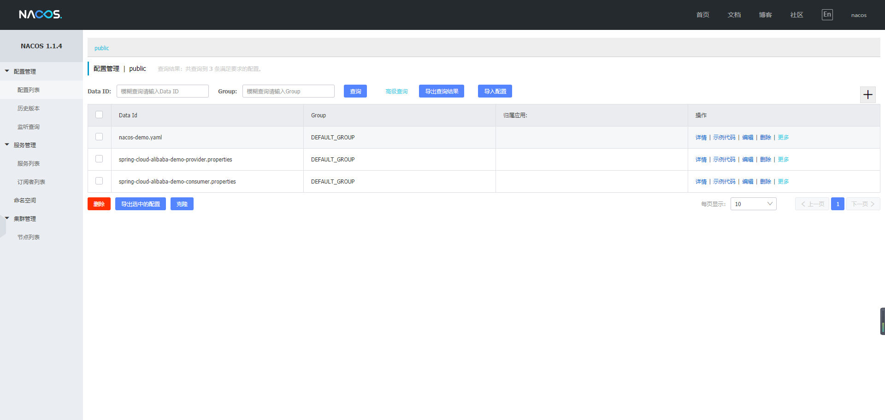
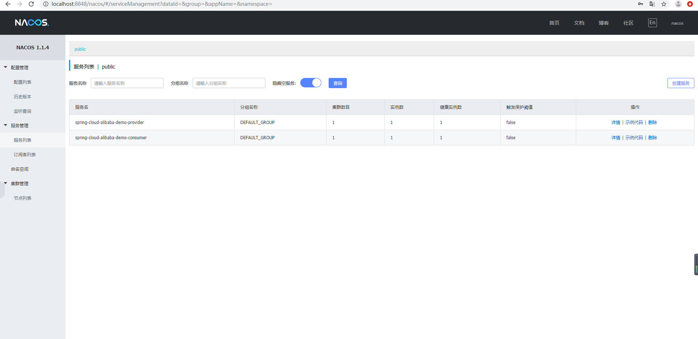
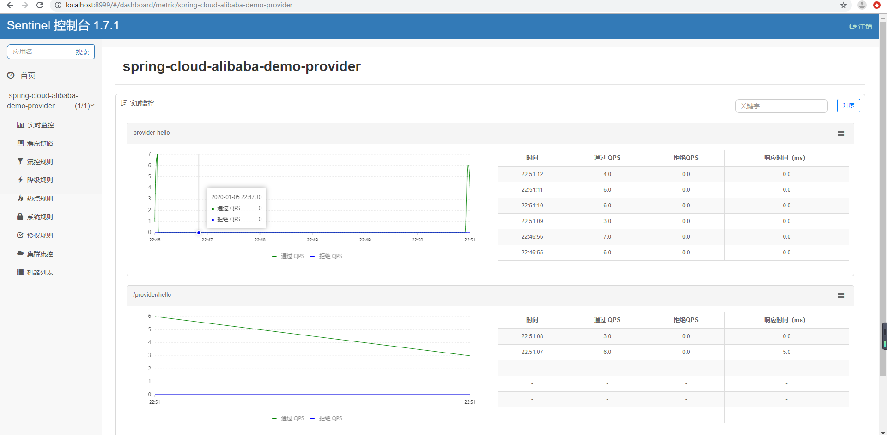

# spring-cloud-alibaba-demo

# 一、介绍

本工程演示了 spring cloud alibaba 中基本组件如何使用，目的是帮助初学者入门。

spring cloud alibaba 详情： https://github.com/spring-cloud-incubator/spring-cloud-alibaba

为了便于初学者一步步学习，默认分支未包含 seata 入门demo，seata 演示切换至 seata 分支。

# 二、主要组件说明

编号 | 模块 | 描述 | 项目地址
----|----|----|----
1 | Spring Cloud Alibaba Nacos | 一个更易于构建云原生应用的动态服务发现、配置管理和服务管理平台。 | https://github.com/alibaba/nacos
2 | Spring Cloud Alibaba Dubbo | RPC组件 | https://github.com/apache/incubator-dubbo
3 | Spring Cloud Alibaba Sentinel | 把流量作为切入点，从流量控制、熔断降级、系统负载保护等多个维度保护服务的稳定性。 | https://github.com/alibaba/sentinel
4 | Spring Cloud Alibaba Seata | 原 Fescar，即分布式事务解决方案 | https://github.com/seata/seata

> 查看更多 ： https://github.com/spring-cloud-incubator/spring-cloud-alibaba

# 三、Spring Cloud Alibaba Nacos

## 1.简介

微服务的注册中心和配置中心。

官方文档: https://nacos.io/zh-cn/docs/what-is-nacos.html

## 2.下载
nacos 不像 eureka 那样新建 spring boot 工程，引入 eureka 依赖后加 `@EnableEurekaServer` 就可以运行了。
nacos 一般通过下载，然后运行，启动服务，本文使用的是 1.1.4 版本（2020/1/5 最新版）。

下载地址 ： https://github.com/alibaba/nacos/releases

## 3.启动
下载好后进入 bin 目录点击对应的文件即可运行。（需要保证环境变量中存在 JAVA_HOME，即 %JAVA_HOME%/bin/java.exe存在）

windows 为例点击 startup.cmd 即可运行。

详细文档 ： https://nacos.io/zh-cn/docs/quick-start.html

## 4.增加配置信息

https://nacos.io/zh-cn/docs/quick-start-spring-cloud.html

## 5.控制台

默认地址 ： http://localhost:8848/nacos

默认帐号/密码 ： nacos/nacos

## 工程代码里接入 nacos

pom.xml 引入nacos相关依赖（见具体 pom）
 
```yaml
spring:
  application:
    name: spring-cloud-alibaba-demo-consumer
  cloud:
    # 对接 nacos 
    nacos:
      discovery:
        server-addr: 127.0.0.1:8848
      config:
        server-addr: 127.0.0.1:8848
```

nacos 动态配置：待更新

nacos 服务发现：待更新

## 效果图




# 四、Spring Cloud Alibaba Dubbo
## 1.简介

官方文档: http://dubbo.incubator.apache.org/zh-cn/docs/user/quick-start.html

## 1.服务接入


## 补充：Dubbo-Admin控制台（当前只有0.2dev分支，在重构中，暂不展示）

### 下载

https://github.com/apache/incubator-dubbo-admin

##### 1. 下载源码
```git clone https://github.com/apache/dubbo-admin.git```

##### 2. 修改配置
下下来发现默认注册中心 zk，这里修改为 nacos

在 `dubbo-admin-server/src/main/resources/application.properties` 中指定注册中心地址

```properties
admin.registry.address=nacos://127.0.0.1:8848
admin.config-center=nacos://127.0.0.1:8848
admin.metadata-report.address=nacos://127.0.0.1:8848
```
##### 编译构建
``` mvn clean package -Dmaven.test.skip=true```

### 启动

```mvn --projects dubbo-admin-server spring-boot:run```
或者
```cd dubbo-admin-distribution/target```

```java -jar dubbo-admin-0.2.jar```

启动 ： java -jar dubbo-admin-0.1.jar --server.port=8000

## 访问 

http://localhost:8080

## 效果图
略

# 五、Spring Cloud Alibaba Sentinel

# 1. 简介
官方文档: https://github.com/alibaba/Sentinel/wiki

## 2.下载

https://github.com/alibaba/Sentinel/releases

## 3.启动

```
java -Dserver.port=8999 -jar "sentinel-dashboard-1.6.0.jar"
```
默认端口为 8080，这里改为 8999

更多启动参数 ： https://github.com/alibaba/Sentinel/wiki/%E5%90%AF%E5%8A%A8%E9%85%8D%E7%BD%AE%E9%A1%B9

控制台地址 ： http://localhost:8999/

默认帐号密码 ：sentinel/sentinel


## 4.应用接入
pom.xml
```xml
<dependency>
    <groupId>org.springframework.cloud</groupId>
    <artifactId>spring-cloud-starter-alibaba-sentinel</artifactId>
</dependency>
```
配置
```yaml
spring:
  cloud:
    sentinel:
      transport:
        dashboard: localhost:9999
```

## 5.效果图




# 六、演示源码

## 1.Github
https://github.com/ChinaLym/spring-cloud-alibaba-demo

## 2.Gitee
https://gitee.com/ChinaLym/spring-cloud-alibaba-demo